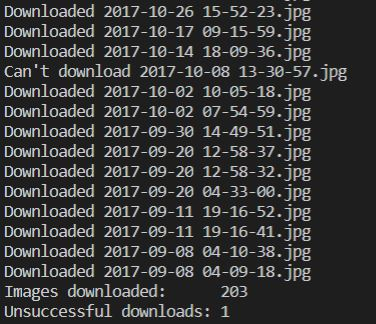

# snapchat_nofilter_downloader
This program downloads your Snapchat images from Memories but without filters. The people that no longer like their date/time filters, stickers, etc. on their images, can now quickly save the original images.

## Features
- It downloads the images from your snapchat Memories (your media files stored on Snapchat's servers) with the filters removed.
    - Includes removal of:
    ```diff
    + color filters
    + location filters
    + stickers
    + drawings
    + text
    ```
    - Excludes removal of:
    ```diff
    - lenses
    ```
- It changes the Exif data of each image so that it corresponds with the rough date and time of when each image was taken (the default date and time is the date and time when the file was downloaded).
- It keeps track of which image was, and which image wasn't downloaded, and how many of them were or weren't downloaded.

## How to use
1. Make sure you have Python 3 installed.
2. Request your Snapchat data within the app by going to Settings -> My Data -> Submit Request
3. Download your data from your your email.
4. Move the downloaded zip file inside of the `snapchat_nofilter_downloader` directory.
5. Run `pip3 install -r requirements.txt` in your terminal.
6. Run `python3 app.py` in your terminal.
7. Wait for your images to be downloaded inside the `media` directory.